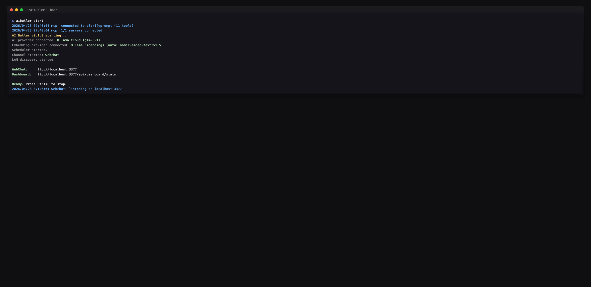
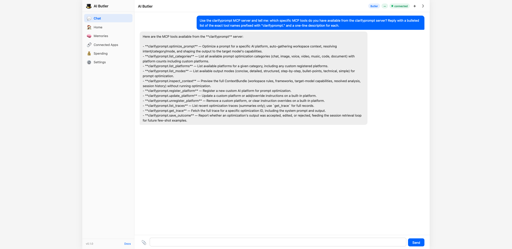
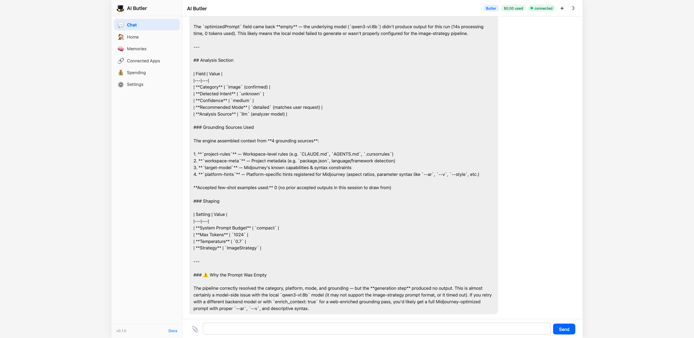

# ClarifyPrompt MCP

[](https://www.npmjs.com/package/clarifyprompt-mcp)
[](https://github.com/LumabyteCo/clarifyprompt-mcp/pkgs/container/clarifyprompt-mcp)
[](https://github.com/LumabyteCo/clarifyprompt-mcp/actions/workflows/evals.yml)
[](https://opensource.org/licenses/Apache-2.0)
[](https://nodejs.org/)
[](https://glama.ai/mcp/servers/LumabyteCo/clarifyprompt-mcp)

A **context-aware MCP prompt compiler** that transforms vague prompts into platform-optimized prompts for 60+ AI platforms across 7 categories — grounded in your workspace signals (CLAUDE.md, AGENTS.md, .cursorrules, package.json), resolved intent, and the capabilities of the target model.

Send a raw prompt. ClarifyPrompt gathers the right context, resolves what you're actually trying to do, and returns a version specifically optimized for Midjourney, DALL-E, Sora, Runway, Higgsfield, ElevenLabs, Claude, ChatGPT, Cursor, or any of the 60+ supported platforms — with the right syntax, parameters, structure, and grounding.

> **New in 1.13.0:** **Plain-language rewrites.** Optimized prompts now stick to common, everyday words instead of drifting into formal vocabulary ("use", never "utilize") — specificity comes from concrete details, not fancier synonyms. `critique_prompt` gained a 6th default dimension, **`plain_language`**, so `auto_revise` loops correct register drift automatically. Also fixed: an explicit `mode` (e.g. `simple`) is no longer silently dropped for small local models under compact system-prompt shaping. See [CHANGELOG.md](./CHANGELOG.md).
>
> **New in 1.12.1:** The real fix for [#3](https://github.com/LumabyteCo/clarifyprompt-mcp/issues/3) — **thinking-channel models (gpt-oss, glm, …) now reliably produce optimized prompts** instead of occasionally returning empty content. Root cause (re-investigated from scratch): they spend their token budget on the *thinking* channel first and never reach the final answer. The fix is a `max_tokens` floor for reasoning models (universal) plus `reasoning_effort: "low"` (for families that honor it, like gpt-oss; tune with `LLM_REASONING_EFFORT`) — not the previously-assumed `/api/chat` switch, which turned out to be a dead end. Verified on `gpt-oss:20b-cloud` and `glm-5.2:cloud` (both 0% empty). See [CHANGELOG.md](./CHANGELOG.md).

## How It Works

ClarifyPrompt does two things a plain prompt template can't. Every output below is a **real, unedited capture** from `optimize_prompt` run against this repo (see [Provenance](#provenance) at the end of this section).

**1 — It knows each platform.** Same raw prompt, different target, completely different output:

```text
You write:    "a dragon flying over a castle at sunset"

→ Midjourney  A colossal, majestic dragon with shimmering scales soaring over a towering
              medieval stone castle, dramatic sunset sky with vibrant orange and deep purple
              hues, cinematic fantasy concept art, volumetric lighting, highly detailed
              --ar 16:9 --v 6.1 --s 250 --q 2

→ DALL-E      A majestic dragon with glowing crimson scales soars over a towering medieval
              stone castle, silhouetted against a vibrant orange and purple sunset sky.
              Rendered in a high-fantasy digital art style with dramatic, warm lighting and
              highly detailed textures, wide aspect ratio.
```

Midjourney gets `--ar/--v/--s/--q` flags; DALL-E gets flag-free natural-language prose. Same intent, each platform's native dialect.

**2 — It knows what you're working on.** This is the part a template can't fake. Drop a vague one-liner while editing `src/transport.ts` *in this very repo*, and the engine grounds it in your real workspace — `package.json`, git state, the active file — and resolves intent **before** it shapes the output:

```text
You write:    "add a configurable request timeout to the http transport"
              · active file: src/transport.ts   · resolved intent: production-code
              · grounded in: active-file · workspace-meta · git-state · environment ·
                target-model · platform-hints

→ Cursor      Implement a configurable request timeout for the HTTP transport in
              `src/transport.ts`.
              Requirements:
              1. Add a new environment variable `CLARIFYPROMPT_HTTP_TIMEOUT` … (default 30000 ms)
              2. Apply this timeout to all incoming requests in the streamable-http transport
              …
              5. Preserve existing behavior for stdio and a2a transports
              …
              The implementation should be added to the streamable-http section of
              `startTransport()`.
              (excerpted — the full rewrite has 7 numbered requirement groups)
```

Nothing in that one-line prompt mentioned the `CLARIFYPROMPT_HTTP_*` naming convention, the `startTransport()` entry point, or the stdio/a2a transports it must preserve — the engine read those from the active file and `package.json` and folded them in. That's the difference between *rephrasing a prompt* and *compiling it against context*.

**3 — It can run the whole pipeline.** clarify → ground/optimize → critique → revise, in one `compose_prompt` call — see **Previously in 1.4.0 — the composable pipeline** below.

> <a name="provenance"></a>**Provenance.** Image outputs captured via `glm-5.2:cloud`, the grounded code output via `qwen3-coder:480b-cloud` — both [Ollama](https://ollama.com) cloud models served over Ollama's OpenAI-compatible endpoint (`LLM_API_URL=http://localhost:11434/v1`), run through `optimize_prompt` against this repo on 2026-06-22. ClarifyPrompt is model-agnostic (any OpenAI-compatible API, local or hosted); outputs are model-dependent — yours will differ in wording, not in structure.

## What's new in 1.13.0

**Plain-language rewrites, end to end.** LLMs handle common, everyday wording more reliably than formal synonyms of the same meaning — and small local models, ClarifyPrompt's default targets, benefit the most. This release bakes that into every stage that shapes output wording:

- **The optimizer prefers common words.** A new core principle in the shared system prompt ("USE COMMON WORDS") applies to all 7 category strategies and both `optimize_prompt` and `ground_prompt`: never swap in a rarer word where a common one carries the same meaning. Detail means more information, not fancier words — specificity, structure, and constraints are untouched.
- **`critique_prompt` gained a 6th default dimension: `plain_language`.** It penalizes needlessly formal or rare vocabulary where a simpler word would do. Because the rewrite pass applies every suggestion from dimensions scoring below 7, `auto_revise` loops now correct register drift for free. Custom `criteria` overrides are unaffected.
- **Fixed: explicit `mode` no longer silently dropped for small local models.** Compact system-prompt shaping used to trim the mode instructions entirely — so `mode: "simple"` had no effect on 3B-class models. Every mode now survives compact shaping as a one-line rule.
- **Two new eval fixtures** guard the behavior: `31-plain-language-vocabulary` (optimized output must not contain formal-register words) and `32-shape-compact-keeps-mode` (the mode line reaches small models).

## What's new in 1.12.1

The real fix for issue [#3](https://github.com/LumabyteCo/clarifyprompt-mcp/issues/3): **thinking-channel models now reliably produce optimized prompts** instead of intermittently returning empty content. Both `gpt-oss:20b-cloud` and `glm-5.2:cloud` went from empty ~40% of runs to **0%**.

Re-investigating from scratch overturned the documented root cause. It was **never** "Ollama's `/v1` shim drops the harmony final channel." These models spend their `max_tokens` budget on the **thinking channel first** and never reach the final channel — so `content` comes back `""` (worse at higher reasoning effort). Two levers, applied together because different families honor different ones:

- **A `max_tokens` floor (8192) for detected reasoning models** — the *universal* lever. It attacks the root cause directly, so it works regardless of which thinking knob a family respects. It's a ceiling, not a target: short answers finish early, so no added latency.
- **`reasoning_effort: "low"`** — for families that respect it (gpt-oss), also trimming latency/cost. Tune with **`LLM_REASONING_EFFORT`** (`low` | `medium` | `high`).

The levers are genuinely family-specific: **gpt-oss** honors `reasoning_effort` but ignores Ollama's `think`; **glm** is the exact opposite — it ignores `reasoning_effort`, so only the budget floor saves it.

**Detection is robust, not a hardcoded model list** (which would rot as new models ship). "Is this a thinking model?" is answered, cached per model, by: (1) **the runtime itself** — Ollama's `/api/show` reports a `thinking` capability (this is how `minimax-m3:cloud` is detected, with no name match); (2) **response-learning** — any reasoning trace, or empty-content-with-tokens, marks that model thereafter (works for any provider); (3) a small name hint as last resort. Non-reasoning models stay byte-identical, and the name-agnostic empty-content retry is the final backstop. Validated on `gpt-oss:20b-cloud`, `glm-5.2:cloud`, and `minimax-m3:cloud` (all 0% empty on the first call).

> The previously-proposed "switch to Ollama's native `/api/chat`" was a **dead end** — `/api/chat` with `think:false` *still* returns empty content for gpt-oss (it ignores it), and it would have added a fragile second code path.

## What's new in 1.12.0

Step #7 — the final step — of the [MCP modernization roadmap](./docs/audits/mcp-completeness-2026-05.md): ClarifyPrompt now speaks **A2A (Agent-to-Agent)**, so other agents can call it to compile prompts. **stdio stays the default; nothing about existing setups changes.**

Set `CLARIFYPROMPT_TRANSPORT=a2a` and ClarifyPrompt comes up as a discoverable A2A peer on Node's built-in `http` (the only new dependency is the official `@a2a-js/sdk`, which itself pulls just `uuid`):

| Endpoint | Purpose |
|---|---|
| `GET /.well-known/agent-card.json` | **Agent card** — discovery: identity, capabilities, the `compile-prompt-for-platform` skill |
| `POST /a2a` | A2A **JSON-RPC 2.0**: `message/send`, `message/stream` (SSE), `tasks/get`, `tasks/cancel`, … |
| `GET /health` | Liveness probe |

```bash
CLARIFYPROMPT_TRANSPORT=a2a CLARIFYPROMPT_HTTP_PORT=3000 npx clarifyprompt-mcp
# → card:  http://127.0.0.1:3000/.well-known/agent-card.json
# → a2a:   POST http://127.0.0.1:3000/a2a   (message/send · message/stream)
```

The whole roadmap pays off here — one incoming A2A message flows through the same compose pipeline, and the primitives built in earlier steps map straight onto A2A semantics:

- **Compile** — a `message/send` with the raw prompt (plain text, or JSON `{ prompt, platform?, category?, … }`) returns a task whose **artifact** carries the optimized prompt (text) plus the full structured compose result (data).
- **Streaming** (1.10.0 progress → A2A) — `message/stream` emits `status-update` events as each pipeline stage runs, then the artifact, over **SSE**.
- **Cancellation** (1.10.0 AbortSignal → A2A) — `tasks/cancel` aborts the in-flight compose within milliseconds and reports a terminal `canceled` state.
- **Clarification** (1.9.0 elicitation → A2A) — clarify is **off by default** for one-shot peers; opt in with `pre_clarify: 'auto' | 'always'` and an ambiguous prompt pauses the task in A2A's first-class **`input-required`** state with the questions (readable text + structured data). Answer on the same task and it compiles.

Configure the public base URL advertised in the card with `CLARIFYPROMPT_A2A_BASE_URL` (handy behind a proxy); port/host are shared with `streamable-http`. New deterministic `npm run test:a2a` battery drives card discovery, a live compile, the clarify round-trip, and SSE streaming.

## What's new in 1.11.0

Step #6 of the [MCP modernization roadmap](./docs/audits/mcp-completeness-2026-05.md): a pluggable **transport factory** — ClarifyPrompt can now serve over **Streamable HTTP**, the runway toward A2A and remote MCP hosts. **stdio stays the default; nothing about existing setups changes.**

### Transports

Set `CLARIFYPROMPT_TRANSPORT`:

| Value | Behaviour |
|---|---|
| `stdio` (default) | One server over stdin/stdout — exactly as before |
| `streamable-http` | MCP Streamable HTTP over Node's built-in `http` (no new deps): stateful sessions (`mcp-session-id`), SSE streaming, a `/health` probe |
| `a2a` | Serve as an **A2A (Agent-to-Agent)** peer — agent card, JSON-RPC + SSE (see 1.12.0 above) |

HTTP knobs (in `streamable-http` / `a2a` mode): `CLARIFYPROMPT_HTTP_PORT` (3000), `CLARIFYPROMPT_HTTP_HOST` (`127.0.0.1` — localhost-only by default), `CLARIFYPROMPT_HTTP_PATH` (`/mcp`, streamable-http only).

```bash
CLARIFYPROMPT_TRANSPORT=streamable-http CLARIFYPROMPT_HTTP_PORT=3000 npx clarifyprompt-mcp
# → POST http://127.0.0.1:3000/mcp  ·  GET http://127.0.0.1:3000/health
```

Tool/resource registration moved into an exported `createServer()` factory: stdio gets one server, **streamable-http gets one per session** (the SDK-recommended, GHSA-safe pattern — never shares a server across HTTP clients). New deterministic `npm run test:http` battery drives a full HTTP session.

## What's new in 1.10.0

Step #5 of the [MCP modernization roadmap](./docs/audits/mcp-completeness-2026-05.md), stable core: **`compose_prompt` is cancellable and reports live progress**. Model-agnostic, opt-in, fully back-compat.

### Cancellation

An `AbortSignal` is plumbed through the entire LLM path (`simpleGenerate` → `chat` → `fetch`, combined with the per-call timeout) and every engine stage. When a client sends `notifications/cancelled` for a `compose_prompt` call, the in-flight model request aborts immediately and the revise loop stops at the next stage boundary — instead of running every iteration to completion. The signal reaches `fetch` regardless of which model/provider is configured.

### Progress

Include a `progressToken` in the `compose_prompt` request `_meta` and the server emits `notifications/progress` at each stage (clarify / optimize / ground / critique) with a monotonic counter and a human message like `optimizing prompt [iter 2/3]`. Hosts can show a live status on a long multi-iteration compose. No token → no notifications, zero overhead.

### Why not MCP tasks (yet)

Roadmap #5 named the MCP **tasks** API. It's still `experimental/` in the SDK ("may change without notice"), its reference is ~600 lines, and no current client speaks the `tasks/*` protocol — so a full implementation would be unusable off-by-default code today. The real value (cancellable + progress-reporting compose) is delivered here on **stable** primitives; the experimental async-task wrapper is deferred to land with #7 (A2A), which the `AbortSignal` groundwork here already sets up. New deterministic `npm run test:cancel` battery locks the behavior.

## What's new in 1.9.0

Step #4 of the [MCP modernization roadmap](./docs/audits/mcp-completeness-2026-05.md): **`clarify_with_user` can elicit answers through the host's native form UI**. Opt-in, fully back-compat.

### Interactive clarification

Pass `elicit: true`. On a client that supports MCP elicitation, the clarifying questions become a real form:

- each question is a field, `options` become enum dropdowns, and each `suggestedAnswer` is the field default (one-click accept);
- the user answers inline; the engine returns `answers: [{ question, dimension, answer, usedSuggested }]` with `elicited: true`.

Without `elicit`, on a non-capable client, or if the round-trip errors, the tool returns the same raw-questions JSON it always has — every existing caller is unaffected. `decline` / `cancel` are surfaced via `elicitationAction`.

This turns clarification from "here's a JSON blob of questions, you render it" into a first-class interactive moment in hosts like Claude Desktop. The mapping lives in a small pure module (`src/engine/clarification/elicit.ts`), reusable by `compose_prompt`'s pre-clarify stage later. New deterministic `npm run test:elicit` battery (pure helpers + a live mock-client round-trip) locks it.

## What's new in 1.8.0

Step #3 of the [MCP modernization roadmap](./docs/audits/mcp-completeness-2026-05.md): the engine's read surfaces become **browseable resource templates** with **argument autocompletion**. No tool or engine behavior changes.

### Resource templates

Four templates join the static `clarifyprompt://categories`, each backed by an existing engine getter:

| URI template | What it reads |
|---|---|
| `clarifyprompt://platforms/{category}/{id}` | One platform's full config — `resources/list` enumerates all 60+ as individual URIs |
| `clarifyprompt://traces/{date}` | Optimization-trace summary index for a UTC day |
| `clarifyprompt://packs/{id}` | One loaded knowledge pack's metadata |
| `clarifyprompt://memory/facts/{scope}` | Live remembered facts under a scope |

MCP hosts with a resource browser (Claude Desktop, Cursor) now get a navigable tree instead of a single static blob.

### Autocomplete

`completion/complete` resolves the template variables: `{category}` → the 7 category ids, `{id}` → platform ids scoped by the chosen `{category}`, `{date}` → days with traces, pack ids, memory scopes. (MCP completion applies to prompt args + resource-template variables only — not tool inputs; ClarifyPrompt registers no prompts, so it lives on the templates.)

### Capabilities

The server now advertises `resources` (with templates) and `completions` at `initialize`. New deterministic `npm run test:resources` battery locks the surface.

## What's new in 1.7.1

Patch fixing [#3](https://github.com/LumabyteCo/clarifyprompt-mcp/issues/3): a **silent empty optimized prompt** from models whose answer didn't land in `content`.

- **Reads all three thinking-channel field names** (`reasoning` / `thinking` / `reasoning_content`) — fixes DeepSeek / qwen-thinking and similar.
- **Retries once, then fails loudly** when content is empty regardless of any thinking field. This covers the real issue #3 case: gpt-oss harmony output over Ollama's `/v1` shim generates tokens (`completion_tokens > 0`) but returns `content: ""` with no thinking field. The engine now degrades to the original prompt + a surfaced `error` instead of returning blank.
- **Genuinely recovering** gpt-oss harmony output (via Ollama's native `/api/chat`) was tracked as a follow-up — **resolved in 1.12.1**, which proved the `/api/chat` path a dead end and fixed the actual root cause (a `max_tokens` floor + `reasoning_effort` for reasoning models; see the 1.12.1 notes above).
- **New deterministic `npm run test:thinking`** battery locks the regression with mocked responses (no live cloud dependency).

Verified: `test:thinking`, reasoning battery (gpt-oss degrades loudly; the genuine reasoner `kimi-k2-thinking:cloud` still returns real content), integration, day2, evals, wire.

## What's new in 1.7.0

Step #2 of the [MCP modernization roadmap](./docs/audits/mcp-completeness-2026-05.md): the entire tool surface migrated off the deprecated `server.tool()` shorthand (removed in SDK 2.0) onto `server.registerTool()`. **No engine behavior changes; full back-compat.**

### What hosts get

- **Titles** — every tool has a human-readable display name ("Forget a fact", not `memory_forget`).
- **Behavior annotations** — all 23 tools declare `readOnlyHint` / `destructiveHint` / `idempotentHint` / `openWorldHint`. The three destructive tools (`memory_forget`, `unload_pack`, `unregister_platform`) are flagged for confirmation UIs; the seven read-only inspectors are flagged safe-to-call-freely; the seven tools that reach the network (LLM / embeddings / web search) carry `openWorldHint: true`.
- **Structured output** — every tool declares an `outputSchema` and returns `structuredContent` alongside the JSON text. Schemas are permissive by design (all-optional, passthrough) — they document the shape without ever rejecting engine output.

### Back-compat

Text content is byte-identical for every tool — including the three array-returning `list_*` tools, whose text stays a bare array while `structuredContent` wraps it in an object per the MCP spec. Error returns unchanged. Verified: wire 7/7, integration 9/9, day2, 26/27 evals with zero output-validation errors.

### Found during verification

[#3](https://github.com/LumabyteCo/clarifyprompt-mcp/issues/3) — cloud `gpt-oss` thinking-channel responses can yield an empty `optimizedPrompt` (remote API change exposing a pre-existing field-name gap in `client.ts`; fix targeted for 1.7.1).

## What's new in 1.6.8

Housekeeping release closing the loops the 1.6.5→1.6.7 cascade opened. **No engine code, MCP tool surface, platform, or env-var changes.**

### Changed

- **CI matrix now tests Node 24** (current active LTS, EOL Apr 2028) alongside 18/20/22 across Ubuntu + macOS. The matrix previously tested two EOL Node versions but not the current LTS at all. Verified before merge that the native deps (`better-sqlite3` + `sqlite-vec`) load and function on Node 24.16.0 in a toolchain-free `node:24-slim` container. `engines` stays `>=18` — maximum compatibility, and we test what we claim.
- **Publish runner moved Node 20 → 22**, keeping an EOL runtime off the release-critical path (matches the Dockerfile base).

### Process

- **New ship-check `CP-13 — lockfile regeneration safety`** encodes the lesson from the 1.6.5→1.6.6→1.6.7 cascade: a single `npm install --package-lock-only` silently dropped 4 of 5 `sqlite-vec` platform binaries (broke Linux CI) *and* pulled a within-caret `better-sqlite3` bump that dropped Node 20 prebuilds (broke the Docker build). The check mandates full `npm install` on dep changes, a lockfile diff for dropped platform deps + native-dep version jumps, and a local slim-Docker load gate. Dogfooded on this release.

## What's new in 1.6.7

Dockerfile patch. **No engine code, MCP tool surface, platform, or env-var changes.**

### Fixed

- **`CI / docker build` failed on 1.6.6** with `npm error gyp ERR! find Python`. Root cause: `better-sqlite3@12.10.0` ([released 2026-05](https://github.com/WiseLibs/better-sqlite3/releases/tag/v12.10.0)) explicitly removed prebuilt binaries for Node.js v20 and v23 because Node 20 reached EOL in April 2026. The 1.6.6 lockfile regen pulled 12.10.0 within the `^12.9.0` caret, and `node:20-slim` doesn't have Python + a C++ toolchain to compile from source. Bumped the Dockerfile base to `node:22-slim` — current active LTS, still has working prebuilts.
- The non-Docker CI build matrix (Node 18 / 20 / 22 across macOS + Ubuntu) still passes because regular runners can compile-from-source as fallback. Only the slim Docker image stumbles.

### Verified locally

`docker build` → green. Container can `require('better-sqlite3')` + `require('sqlite-vec')` cleanly. All 5 `sqlite-vec` platform binaries still in `package-lock.json` (1.6.6's fix held).

## What's new in 1.6.6

Lockfile + harness patch following 1.6.5. **No engine code, MCP tool surface, platform, or env-var changes.** Ships the MCP-completeness audit doc.

### Fixed

- **`package-lock.json` lost 4 of 5 `sqlite-vec` platform binaries during the 1.6.5 SDK bump.** My local `npm install --package-lock-only` retained only the maintainer's `sqlite-vec-darwin-arm64` binary. `npm ci` on CI's Ubuntu runners failed with `no such module: vec0` because `sqlite-vec-linux-x64` wasn't in the lock. End-user `npm install clarifyprompt-mcp@1.6.5` was **never affected** (the npm tarball doesn't ship a lockfile; users resolve platforms at install time). Regenerated with full `npm install` so all 5 platforms (`darwin-arm64`, `darwin-x64`, `linux-arm64`, `linux-x64`, `windows-x64`) are back.
- **Eval harness HTML report writer crashed on ERRORED entries** (`evals/run.mjs:729`). The pre-existing renderer assumed every non-skipped, non-filtered run had an `evaluation.checks` field, but errored runs carry an `error` field instead. Added an explicit errored-status branch — the harness now degrades gracefully and exits cleanly even when fixtures error.

### Bundled docs

- **[`docs/audits/mcp-completeness-2026-05.md`](./docs/audits/mcp-completeness-2026-05.md)** — diagnostic audit of the engine's MCP surface against the current SDK + spec. Tool-by-tool registration table, resource gap analysis, SDK feature delta (1.12 → 1.29 → 2.0-alpha), capability declarations, transport refactor sketch, A2A feasibility note, and a sequenced 7-step modernization roadmap. The artifact behind next-session planning. No engine changes prescribed inline.

### Numbers

- 5 sqlite-vec platforms in lockfile (was 1). `npm audit --production`: 0 vulnerabilities (unchanged). Tools: 23 (unchanged). Eval fixtures: 30 (unchanged).

## What's new in 1.6.5

Security patch. **No engine code changes, no MCP tool surface changes, no platform changes, no env-var changes.**

### Fixed

- **CVE-2026-0621** — ReDoS in `@modelcontextprotocol/sdk`'s `UriTemplate` regex (patched in SDK `1.25.2`). The previous `^1.12.1` floor *allowed* vulnerable resolutions on stale npm caches; bumped to `^1.29.0` so the floor itself is patched.
- **GHSA-345p-7cg4-v4c7** — Shared server/transport instances leak cross-client response data (patched in SDK `1.26.0`). Not exploitable in practice for ClarifyPrompt (one host = one server instance) but the vulnerable code is now out of the dependency graph entirely.
- **7 transitive vulnerabilities** (2 moderate, 5 high) in the SDK's bundled HTTP-transport substack (`hono`, `express-rate-limit`, `fast-uri`, `ip-address`, `path-to-regexp`, `qs`, `@hono/node-server`). Cleared via `npm audit fix`. Never affected runtime — ClarifyPrompt is stdio-only and doesn't load the HTTP transport — but they were noise in users' `npm audit` reports and made the install look unsafe.

### Numbers

- `npm audit --production` → **0 vulnerabilities** (was 2 SDK CVEs + 7 transitive).
- `package-lock.json`: **net −336 lines** (the old caret was pulling in heavy unused HTTP-transport ancillaries; the fix swapped them for slimmer alternates).
- Tools: 23 (unchanged). Platforms: 60+ (unchanged). Eval fixtures: 30 (unchanged).
- Wire test + integration battery + day2 + reasoning + 29/30 evals pass against the new floor on local Ollama. The one eval fail (`analyzer-creative-media`) is a pre-existing qwen-coder-7b classifier flake — verified SDK-independent by stash-reverting and re-running.

### Why the floor bump matters

`^1.12.1` was misleading documentation — caret resolution was actually pulling SDK `1.27.1` for any fresh `npm install` since early 2026. The floor bump aligns the declared baseline with what `npm` was already doing for most users while guaranteeing the floor for users on stale caches. It also positions us for the eventual `2.0.0-alpha` migration when that line stabilizes (the modern SDK deprecates `.tool()` / `.prompt()` / `.resource()` shorthand registration in favor of `registerTool()` / `registerPrompt()` / `registerResource()` with title + outputSchema + annotations).

## What's new in 1.6.4

Docs + process patch. **No engine, MCP tool, or platform changes** — but a meaningful cleanup of the pack-distribution model.

### Pack registry consolidated back into the engine repo

`LumabyteCo/clarifyprompt-packs` (the separate community-pack registry created in `1.3` with the right principle but at the wrong scale) has been **archived**. Its three starter packs already lived in this repo's [`packs/`](./packs/) folder; the registry was meant to be the canonical home but in practice everything always shipped from here via the npm tarball. The drift caught up: `higgsfield-creative-handbook` shipped in `1.6.2` and never made it to the registry, even though the registry's own README told users to fetch packs from there.

Net result of 1.6.4:

- **Single source of truth.** `packs/*.md` knowledge packs + `packs/platforms/*.yaml` platform configs all live in `clarifyprompt-mcp` and ship in the npm tarball.
- **New top-level [Knowledge packs](#knowledge-packs) section** in this README explains the loading model (`load_knowledge_pack({source: "<url-or-path>", scope: ...})`), the three starter packs + Higgsfield, the scope semantics, and how to contribute.
- **New [`packs/README.md`](./packs/README.md)** — pack authoring guide (frontmatter schema, chunk boundaries, quality bar). Lifted from the archived registry so the content isn't lost.
- **Tombstone redirect on the archived repo.** Anyone visiting `clarifyprompt-packs` lands on a banner pointing here.

### When does the split come back?

When there's a forcing function: a community PR queue on packs alone, pack count >20, or divergent licensing/governance. Until then the maintenance cost of keeping two repos in sync wasn't paying for an audience that hadn't materialized.

### Numbers

- **Tools:** 23 (unchanged).
- **Platforms:** 60+ (unchanged).
- **Bundled knowledge packs:** 4 (`anthropic-brand-voice`, `higgsfield-creative-handbook`, `nextjs-14-best-practices`, `sox-compliance`) — same as 1.6.2/1.6.3, just newly canonical.
- **Eval fixtures:** 30 (unchanged).
- **Tarball size:** unchanged from 1.6.3.

## What's new in 1.6.3

Patch. The 1.6.2 CI tag-push run surfaced two real issues — fixed here without changing any engine code.

### Fixed

- **`evals/fixtures/28-context-includes-git-state.yaml`** previously asserted `git_branch_present: true`, but GitHub Actions checks out in detached-HEAD mode where `bundle.git.branch` is correctly `undefined` (only the SHA + recent commits are populated). Relaxed to assert `bundle_has_git: true` only — that's what's actually invariant across local + CI environments.
- **`evals/fixtures/17-critique-strong-prompt-accepts.yaml`** asserted `verdict: accept` + `overall_score_min: 7` on a strong prompt. gpt-4o-mini's judge calibrates stricter than qwen2.5-coder:7b's, and occasionally returned a malformed `overall` field that the parser defaulted to 0 → verdict=reject. The fixture's *real intent* is to verify engine wiring (5+ dimensions, the standard dimension names present, no harness error) — not to compare judge calibration across models. Dropped the verdict + tight score assertions; kept the wiring-level checks.
- **README Glama badge** swapped from inline `` (sometimes broken via GitHub's camo proxy) to a shields.io text-link badge that's stable across all rendering surfaces.

### Notes

- **No engine code changes.** No new MCP tools (still 23). No platform changes (still 60+). No env-var changes.
- **Eval baselines unchanged on local Ollama.** This is a CI-specific hardening — local runs against qwen-coder-7b produced the same results before and after.
- **The CI publish-gate failure that appeared on the v1.6.2 tag push** was downstream of the eval failure (`Wait for evals workflow` step blocked publish). Now that the underlying fixtures don't false-fail on gpt-4o-mini + detached-HEAD CI, the publish gate clears too.

## What's new in 1.6.2

Patch. Two additive ships, both no-code-changes from the engine's perspective:

### Higgsfield creative-handbook knowledge pack

`packs/higgsfield-creative-handbook.md` — a community-style markdown pack documenting Higgsfield's actual conventions: model-selection rules (which of the 13 models for which use case), Soul ID character-training workflow, camera-move vocabulary, prompt-structure pattern (long-form prose, not keyword tags), multi-reference editing, Marketing Studio modes, common pitfalls (don't translate Midjourney flags verbatim), output specs.

Load it explicitly:

```
load_knowledge_pack source="https://raw.githubusercontent.com/LumabyteCo/clarifyprompt-mcp/main/packs/higgsfield-creative-handbook.md"
```

…or, since it ships in the npm tarball, point at the installed copy. The Context Curator grounds Higgsfield-targeted prompts in this pack's chunks automatically via semantic retrieval. See the [Knowledge packs](#knowledge-packs) section for the full loading + scoping model.

### `npm run matrix` — multi-model eval matrix runner

`evals/matrix.mjs` runs `npm run eval` sequentially against N models and stitches the results into one side-by-side HTML (`evals/matrix.html` by default). Lights up the model-class-gated fixtures (`shape-small-local-model` / `shape-mid-tier-model` / `shape-reasoning-model`) that single-model runs skip, and exposes deltas like "qwen-7b fails analyzer-creative-media but gpt-4o-mini passes it" in a glance.

```bash
npm run matrix -- --models qwen2.5-coder:7b-instruct-q4_K_M,gpt-oss:20b-cloud,glm-5.2:cloud
```

Outputs a dark-themed table — rows = fixtures, columns = models, cells = pass / fail / skip / errored with tooltips showing which checks failed.

Companion fix: `evals/run.mjs` gains a `--json-out <path>` flag that writes structured per-model results (matrix.mjs uses it; CI agents can use it too).

### Numbers

- **No tool surface change.** Still 23 MCP tools.
- **No platform count change.** 60+ platforms (`packs/platforms/*.yaml` unchanged).
- **30 → 30 fixtures** (no new fixtures; matrix is tooling, not coverage).
- **Tarball grows ~10 KB** for the knowledge pack. `evals/matrix.mjs` is NOT in the tarball — it's a maintainer/contributor tool, not a runtime artifact.

## What's new in 1.6.1

Patch release. Adds **[Higgsfield](https://higgsfield.ai)** as a target platform in both `image` and `video` categories. No code changes — pure YAML platform-pack additions and one eval fixture.

Higgsfield is a multi-model creative platform that exposes its own MCP server at `https://mcp.higgsfield.ai/mcp`. Inside one connection you get:

- **Image**: Soul 2.0, Soul Cinema, Soul Cast (character-consistent), Flux 2, Seedream 5, Nano Banana Pro, GPT Image 2
- **Video**: Cinema Studio, Sora 2, Veo 3.1, Kling 3.0, WAN 2.6, Seedance 2.0
- **Workflows**: Soul ID character training, Lipsync Studio, UGC Factory, Marketing Studio, virality_predictor

The 1.6.1 ClarifyPrompt platform entries surface Higgsfield's model identifiers and prompt-style conventions (long-form natural-language prose; composition + lighting + textures + mood; up to 4K images / 15 s video / Soul ID for character consistency) as syntax hints to the curator.

**Recommended pattern:** install both `clarifyprompt-mcp` AND Higgsfield's MCP in your client (Claude Desktop / Cursor / AI Butler / Claude Code). Use `optimize_prompt(platform: 'higgsfield', ...)` or `compose_prompt(platform: 'higgsfield', ...)` to compile, then pass the compiled prompt to Higgsfield's `generate_image` / `generate_video` tool. MCPs compose at the client; ClarifyPrompt stays at the "compile" layer.

29 → 30 eval fixtures. Same MCP tool surface as 1.6.0 (23 tools, 1 resource). No env-var changes.

## What's new in 1.6.0

Four targeted additions across the engine's four pillars (memory / agentic / models / context), each shipped behind real eval fixtures. **3 new MCP tools** (23 total). Fully back-compat with 1.5.x — no removed tools, no removed fields, no required env-var changes.

### Memory — explicit fact CRUD (`memory_remember`, `memory_forget`, `memory_list_facts`)

Before 1.6, facts only entered persistent memory via *reflection on `save_outcome`* — implicit, LLM-extracted, after-the-fact. 1.6 adds the explicit path:

- **`memory_remember`** — directly insert a `(subject, predicate, object)` triple with explicit confidence. Source tagged `user:explicit`. Auto-embedded for future semantic retrieval.
- **`memory_forget`** — soft-delete (bi-temporal `invalidated_at`) a fact by id. Idempotent: re-forgetting an already-invalidated fact is a no-op and returns `success: false` cleanly.
- **`memory_list_facts`** — list live facts in a scope (default `user`), optionally filtered by predicate. Sorted by most-recently-observed.

This closes the obvious UX gap where the engine could only learn from *outcomes* — now users can say "remember I prefer X" directly.

### Agentic — `compose_prompt`'s new `max_iterations` revise loop

`compose_prompt` used to revise *once* (the critique's `improvedPrompt` replaced the optimization, if the verdict wasn't `accept`). 1.6 adds a loop:

```json
{ "prompt": "...", "post_critique": true, "auto_revise": true, "max_iterations": 3 }
```

Each iteration after the first re-runs `optimize` + `critique` on the previous iteration's improved prompt. Stops at `verdict=accept`, no improvedPrompt to feed back, or the cap. `pre_clarify` only runs once (no point re-asking on a rewrite). The response includes a new `iterations` field showing how many fired. Hard cap of 5 to prevent cost runaways.

### Models — per-stage model routing

Each compose stage can now target a different model:

```json
{
  "prompt": "...",
  "clarify_model": "qwen2.5-coder:7b-instruct-q4_K_M",
  "optimize_model": "claude-sonnet-4-20250514",
  "critique_model": "gpt-4o-mini"
}
```

Run clarify on a cheap local model, optimize on the big-budget frontier model, critique on the cheap judge. The override flows through every layer — `optimization.metadata.model` and `critique.judgeModel` in the response reflect the actual model that ran each stage.

### Context — git-state + environment signals

Two new signal collectors feed the Context Curator:

- **`bundle.git`** — current branch, short SHA, dirty flag, last 5 commit titles. Lets the engine ground prompts in "what you're iterating on" without you spelling it out. Detected via `git rev-parse` / `git status` / `git log`; fails soft when cwd isn't a repo.
- **`bundle.environment`** — `nowIso` / `weekday` / `timezone` (IANA from `Intl.DateTimeFormat`). Helps with time-sensitive prompts ("send this email tomorrow"). Pure JS, never fails.

Both are low-utility candidates in the curator (won't dominate budget) but surface as grounding sources when relevant.

### Eval coverage

23 → **29 fixtures** (6 new):
- 24 `memory-remember-persists` / 25 `memory-forget-invalidates` — Me1 CRUD round-trip
- 26 `compose-loop-iterates` — A1 loop infrastructure (new `iterations_min` / `iterations_max` checks)
- 27 `compose-per-stage-models-honored` — M1 per-stage routing (new `optimization_model_eq` / `critique_model_eq` checks)
- 28 `context-includes-git-state` / 29 `context-includes-environment-time` — C1 + C4 signals (new `bundle_has_git` / `bundle_has_environment` / `git_branch_present` checks)

Local baseline on `qwen2.5-coder:7b`: **25 passed / 1 failed / 3 skipped / 97% avg**. The lone failure remains the persistent `analyzer-creative-media` model-class signal (untouched).

## What's new in 1.5.2

The first release where CI's eval gate (against `gpt-4o-mini`) drove the diff. Three real fixes that the gate caught the moment we wired in the `OPENAI_API_KEY` secret:

- **Memory store now supports any embedding dimension** ([#2](https://github.com/LumabyteCo/clarifyprompt-mcp/issues/2)). The persistent vec table was hardcoded to 768 dims (the nomic-embed-text default), so anyone configuring `EMBED_MODEL=text-embedding-3-small` (1536), `voyage-3` (1024), `embed-english-v3.0` (1024), or any non-768 model would hit `Dimension mismatch: expected 768, got N` on the first `memory_search` call. The store now derives the table name from the embedder's actual dimension and creates the dim-specific table at boot. Existing 768-dim installs are unaffected.
- **`LLM_TIMEOUT_MS` env-var override** on the LLM client. Default stays at 30s; users on slow hosted models can bump it. The eval workflow uses 120s for `gpt-4o-mini`.
- **Eval harness hardened** — no longer crashes when a tool throws an exception (the SDK returns plain-text error responses; the harness used to `JSON.parse` them and die). One bad fixture no longer tanks the whole run.
- **Live evals badge.** The `evals.yml` workflow runs on every push to main. The `[![evals]](...)` badge at the top of this README is its real-time status. Currently green at 20/0/3 · 100% on `gpt-4o-mini`.

No new MCP tools. No env-var surface changes (only an added optional `LLM_TIMEOUT_MS`). Fully back-compat with 1.5.x.

## What's new in 1.5.1

A patch release on top of 1.5.0. Pure docs + ship-process improvements; **runtime behavior is identical to 1.5.0**.

- **README marketing surfaces refreshed** — the 1.5.0 release shipped with the README still on 1.4.0 in three places (headline blockquote, "What's new in X" heading, "cumulative through X" annotation). Every other version surface (`package.json`, `package-lock.json`, `server.json`, `src/index.ts`, `CHANGELOG`) was correct, but the prose drifted because nothing automated touched it. 1.5.1 fixes that.
- **Two new ship-check audits** — `CP-11` (README marketing-surface coherence) hard-fails if any of the three above don't reference the current `package.json#version`. `CP-12` (Platform-pack format validity) parses every `packs/platforms/*.yaml` and asserts schema validity. CP-11 was promoted to the user-scoped (cross-project) ship-check skill the same day, so future projects benefit too.
- **No code changes.** No new MCP tools. No new env vars. Same tarball anatomy as 1.5.0 plus a few hundred bytes of CHANGELOG.

## What's new in 1.5.0

**Built-in platforms become declarative.** The 58+ hardcoded TypeScript platform arrays move to `packs/platforms/*.yaml` — adding a built-in platform is now a YAML edit, not a TS edit. The TypeScript layer becomes a runtime loader with a hardcoded fallback table. Malformed YAML can never soft-brick the server.

```
packs/platforms/
  chat.yaml       9 platforms
  code.yaml       9
  document.yaml   8
  image.yaml     10
  music.yaml      4
  video.yaml     11
  voice.yaml      7
  README.md      contributor docs
```

To add a new built-in platform: append an entry to the relevant category file, run `npm run build`, open a PR. No TS edit required. Custom-platform-via-runtime (`register_platform`) still works identically for user-installed platforms.

- **Memory-layer eval coverage.** The eval harness now supports `setup: [{tool, args}, ...]` — a list of MCP tool calls executed BEFORE the main `input`. Two new fixtures use it: one loads a knowledge pack inline and verifies the chunk surfaces in `grounding.sources` after the embed → store → retrieve → curate → ground pipeline; the other proves vector-search ranking quality. **23 fixtures total** (was 20 in 1.4.0).
- **Test infrastructure modernization.** The integration + Day-2 test batteries used to assert literal version strings (`1.3.0`, `16 tools`) and broke on every bump. Now they read `EXPECTED_VERSION` from `package.json` and assert presence of a tool *set* rather than a tool *count*. Future bumps don't break the tests.
- **Adoption materials.** `docs/adoption/` ships with copy/paste-ready Show HN body, Reddit posts, Twitter thread, awesome-mcp-servers PR template, and catalog submission specs (mcp.so, Smithery, mcp-get, PulseMCP, modelcontextprotocol/servers).
- **One new runtime dep:** `js-yaml` promoted from devDependency for the platform loader (~200 KB).
- **Same MCP tool surface as 1.4.** 20 tools, 1 resource. No new tools; no removed tools; result shapes unchanged.

## Previously in 1.4.0 — the composable pipeline

Four core operations as first-class MCP tools that compose. Use any tool standalone, or run the whole chain in one call:

```
  ┌─────────────┐     ┌─────────────────────┐     ┌──────────────┐
  │  clarify    │ →   │  ground OR optimize │ →   │   critique   │
  │  (optional) │     │       (core)        │     │  (optional)  │
  └─────────────┘     └─────────────────────┘     └──────────────┘

  one call = compose_prompt(prompt, [sources], post_critique, auto_revise, ...)
```

- **`clarify_with_user`** — Given an ambiguous draft, returns 1–3 targeted clarifying questions, each with a `suggested_answer` you can accept verbatim, optional 2–4 quick-pick `options`, and a `dimension` tag (audience/scope/format/length/tone/constraints/goal/platform). Short-circuits with `clarificationNeeded: false` on confident, well-formed prompts so it pipelines cleanly in front of `optimize_prompt` without a per-call latency tax.
- **`ground_prompt`** — The strict, retrieval-augmented variant of `optimize_prompt`. Caller-provided sources are pinned at the **highest** priority — above project rules, above pinned instructions — and tracked individually in the trace as `user-source:N`. Strict mode: zero non-empty sources → error, no silent fall-through. Per-source body cap (4000 chars) so a single huge paste can't dominate the budget.
- **`critique_prompt`** — LLM-as-judge. Scores a candidate prompt 0–10 across 5 default dimensions (clarity, specificity, intent_alignment, format_fitness, length_appropriateness) — or your own criteria — with per-dimension rationale + concrete suggestions, an overall score, and a verdict (`accept` / `revise` / `reject`). Below `revise_threshold` (default 7.0) it also returns an `improvedPrompt` you can drop in. Use it pre-flight ("is this prompt good enough for the expensive model?"), postmortem ("was the prompt the cause?"), or to A/B-pick the best of N optimization variants.
- **`compose_prompt`** — One MCP call runs the canonical pipeline. Auto-decides the ground vs. optimize branch from whether you passed `sources`. `pre_clarify: 'auto' | 'always' | 'never'`. `post_critique: true` adds a judge pass. `auto_revise: true` replaces `final_prompt` with the rewrite when the verdict isn't `accept`. Returns a per-stage `stages` audit array so the caller sees exactly what ran.
- **Eval harness v0** — Deterministic regression tests under `evals/`. 20 YAML fixtures cover analyzer, shape, intent-overlay, grounding, clarify, critique, ground, and compose surfaces. `npm run eval` produces a console summary + self-contained dark-themed HTML report. Multi-model matrix is just bash: run `LLM_MODEL=... npm run eval -- --report-path evals/report-X.html` per model.
- **CI-gated evals (opt-in)** — When `OPENAI_API_KEY` is set as a repo secret, the eval harness runs in CI against `gpt-4o-mini` as a release gate. Off by default; nothing leaves your machine without the secret.
- **5 new MCP tools** (20 total). `optimize_prompt` also gains a `userProvidedSources` injection point — both `ground_prompt` and `compose_prompt` use it under the hood, but it's available directly if you want explicit control without the strict-mode validation.

> Carried over from 1.3: persistent memory + knowledge packs + reflective learning. The curator continues to score and fit grounding sources into the target model's remaining window. `explain_last_curation` still gives you a per-call breakdown of selected vs. rejected candidates with reasons.

## What's in the box (cumulative through 1.13.0)

- **Context Engine** — auto-gathers workspace rules (`CLAUDE.md`, `AGENTS.md`, `.cursorrules`, `.clinerules`, `clarify.md`), detects frameworks and languages from `package.json` and sibling manifests, tracks an active file excerpt, and maintains a per-session ring buffer of recent optimizations **and their outcomes**.
- **Unified `PromptAnalyzer`** — one LLM call produces `{ category, intent, recommendedMode, confidence }` together. 10 intents: `production-code`, `brand-voice`, `stakeholder-comm`, `data-extract`, `creative-media`, `technical-spec`, `analysis`, `quick-draft`, `exploration`, `unknown`. Intent beats surface keywords on ambiguity.
- **Target-model-aware prompt shaping** — system prompt, `maxTokens`, and `temperature` adapt to the downstream LLM's context window and the resolved intent. Small local models get a compact prompt; Claude/GPT-4/Gemini get the full richness.
- **Grounding Context (single, priority-ordered)** — user pinned instructions → project rules → active file → prior accepted examples → web search → workspace metadata → target-model hints → custom platform instructions → built-in syntax hints. No more parallel context silos.
- **Session retrieval (save_outcome)** — the caller reports `accepted | edited | rejected` per optimization; similar accepted outputs in the same session get injected as few-shot examples into future similar prompts. Backed by persistent memory (SQLite + sqlite-vec), so accepted outcomes survive restarts.
- **Local JSONL tracing** — every optimization writes a structured trace line (now with `shape`, `groundingSources`, `error` fields) to `$CLARIFYPROMPT_HOME/traces/YYYY-MM-DD.jsonl`. **Nothing is uploaded.** Toggle via `CLARIFYPROMPT_TRACE=off`.
- **Unified `$CLARIFYPROMPT_HOME`** — one env var for everything ClarifyPrompt writes. Legacy `CLARIFYPROMPT_CONFIG_DIR` / `CLARIFYPROMPT_DATA_DIR` still work (deprecation hint, silenceable).
- **Three transports** — `stdio` (default), `streamable-http` (MCP over Node `http`, stateful sessions + `/health`), and `a2a` (an **Agent-to-Agent** peer: agent card, JSON-RPC `message/send` + SSE `message/stream`, task cancellation, `input-required` clarification). One `CLARIFYPROMPT_TRANSPORT` env var; stdio behavior is byte-identical to before.
- **60+ platforms, 7 categories, custom platforms** — the original core is unchanged and fully backward-compatible.
- **Any LLM, any provider.** One code path works with **any OpenAI-compatible API** — Ollama (local + cloud), LM Studio, vLLM, OpenAI, Google Gemini, xAI Grok, Groq, Mistral, DeepSeek, Cohere, Perplexity, Together, Fireworks, OpenRouter — plus **Anthropic Claude** directly. Reasoning models (`o1/o3/o4`, `deepseek-reasoner`, `gpt-oss`, `*-thinking`) are auto-detected and given a larger token budget so they actually produce content. [See 15+ pre-configured provider examples below](#provider-examples).
- **Apache-2.0, forever.** Open-source core, no relicensing.

## Quick Start

### With Docker

Pull the published image from GitHub Container Registry (multi-arch: `amd64` + `arm64`, with signed provenance + SBOM):

```bash
docker pull ghcr.io/lumabyteco/clarifyprompt-mcp:latest
```

All config is passed at **run time** — nothing is baked into the image, so the image is safe to share and contains no secrets:

```bash
# stdio (for MCP hosts that launch the container)
docker run --rm -i \
  -e LLM_API_URL=http://host.docker.internal:11434/v1 \
  -e LLM_MODEL=qwen2.5:7b \
  -e CLARIFYPROMPT_HOME=/data \
  -v clarifyprompt-data:/data \
  ghcr.io/lumabyteco/clarifyprompt-mcp:latest

# or serve over HTTP / A2A
docker run --rm -p 3000:3000 \
  -e CLARIFYPROMPT_TRANSPORT=a2a -e CLARIFYPROMPT_HTTP_HOST=0.0.0.0 \
  -e LLM_API_URL=http://host.docker.internal:11434/v1 -e LLM_MODEL=qwen2.5:7b \
  ghcr.io/lumabyteco/clarifyprompt-mcp:latest
```

> Mount a volume at `CLARIFYPROMPT_HOME` to persist memory, traces, and packs across runs. Pass `LLM_API_KEY` / `EMBED_API_KEY` as `-e` env vars (or `--env-file`) at run time — never bake them into an image.

### With Claude Desktop

Add to your `claude_desktop_config.json`:

```json
{
  "mcpServers": {
    "clarifyprompt": {
      "command": "npx",
      "args": ["-y", "clarifyprompt-mcp"],
      "env": {
        "LLM_API_URL": "http://localhost:11434/v1",
        "LLM_MODEL": "qwen2.5:7b"
      }
    }
  }
}
```

### With Claude Code

```bash
claude mcp add clarifyprompt -- npx -y clarifyprompt-mcp
```

Set the environment variables in your shell before launching:

```bash
export LLM_API_URL=http://localhost:11434/v1
export LLM_MODEL=qwen2.5:7b
```

### With Cursor

Add to your `.cursor/mcp.json`:

```json
{
  "mcpServers": {
    "clarifyprompt": {
      "command": "npx",
      "args": ["-y", "clarifyprompt-mcp"],
      "env": {
        "LLM_API_URL": "http://localhost:11434/v1",
        "LLM_MODEL": "qwen2.5:7b"
      }
    }
  }
}
```

### With AI Butler

[AI Butler](https://github.com/LumabyteCo/aibutler) is a self-hosted
personal AI agent runtime — single Go binary, multi-channel chat, MCP
ecosystem hub. Drop ClarifyPrompt into its `mcp.servers` config and
the agent picks up all 23 tools as native capabilities, callable from
any channel (web chat, terminal, Telegram, Slack, etc.). AI Butler
discovers tools dynamically via MCP's `tools/list`, so adding /
removing tools in ClarifyPrompt updates the agent's surface
automatically — no config edits needed on the butler side.

Edit `~/.aibutler/config.yaml`:

```yaml
configurations:
  mcp:
    servers:
      - name: clarifyprompt
        command: clarifyprompt-mcp
        env:
          LLM_API_URL: "http://localhost:11434/v1"
          LLM_MODEL: "qwen3-vl:8b"
```

Restart AI Butler. The boot log confirms the tools are wired in:



The agent enumerates the full surface on request — every tool prefixed
with `clarifyprompt.`:



> 📸 **Screenshots above are from a 1.2-era integration (11 tools).**
> Current `1.6.x` exposes **23 tools** — `optimize_prompt`,
> `clarify_with_user`, `ground_prompt`, `critique_prompt`,
> `compose_prompt`, plus the management / inspection / memory
> tools (`memory_search`, `memory_remember`, `memory_forget`,
> `memory_list_facts`, knowledge-pack tools, traces, custom
> platforms, etc.). AI Butler picks them up automatically via the
> MCP `tools/list` discovery; no config changes needed.

#### Drive the Context Engine end-to-end

You can preview what the engine *would* gather (without running the
optimization) using `inspect_context`:


Then run the actual optimizer for any of the 60+ supported platforms:



Every optimization gets a single JSONL line in
`~/.clarifyprompt/traces/YYYY-MM-DD.jsonl` — strictly local, never
uploaded. The `list_traces` tool turns that into a queryable summary
with replay support via `get_trace`:


The full integration walkthrough — including all 11 tools driven from
chat, configuration options, and natural-language usage examples —
is in the AI Butler docs:
**[Integrate an MCP Server](https://docs.aibutler.dev/ecosystem/integrate-mcp/)**.

## Supported Platforms (58+ built-in, unlimited custom)

| Category | Platforms | Default |
|----------|-----------|---------|
| **Image** (11) | Midjourney, DALL-E 3, Stable Diffusion, Flux, Ideogram, Leonardo AI, Adobe Firefly, Grok Aurora, Google Imagen 3, Recraft, **Higgsfield** | Midjourney |
| **Video** (12) | Sora, Runway Gen-3, Pika Labs, Kling AI, Luma, Minimax/Hailuo, Google Veo 2, Wan, HeyGen, Synthesia, CogVideoX, **Higgsfield** | Runway |
| **Chat** (9) | Claude, ChatGPT, Gemini, Llama, DeepSeek, Qwen, Kimi, GLM, Minimax | Claude |
| **Code** (9) | Claude, ChatGPT, Cursor, GitHub Copilot, Windsurf, DeepSeek Coder, Qwen Coder, Codestral, Gemini | Claude |
| **Document** (8) | Claude, ChatGPT, Gemini, Jasper, Copy.ai, Notion AI, Grammarly, Writesonic | Claude |
| **Voice** (7) | ElevenLabs, OpenAI TTS, Fish Audio, Sesame, Google TTS, PlayHT, Kokoro | ElevenLabs |
| **Music** (4) | Suno AI, Udio, Stable Audio, MusicGen | Suno |

## Tools

### `optimize_prompt`

The main tool. Optimizes a prompt for a specific AI platform.

```json
{
  "prompt": "a cat sitting on a windowsill",
  "category": "image",
  "platform": "midjourney",
  "mode": "concise"
}
```

**All parameters except `prompt` are optional.** When `category` and `platform` are omitted, ClarifyPrompt auto-detects them from the prompt content.

Three calling modes:

| Mode | Example |
|------|---------|
| **Zero-config** | `{ "prompt": "sunset over mountains" }` |
| **Category only** | `{ "prompt": "...", "category": "image" }` |
| **Fully explicit** | `{ "prompt": "...", "category": "image", "platform": "dall-e" }` |

**Parameters:**

| Parameter | Required | Description |
|-----------|----------|-------------|
| `prompt` | Yes | The prompt to optimize |
| `category` | No | `chat`, `image`, `video`, `voice`, `music`, `code`, `document`. Auto-detected when omitted. |
| `platform` | No | Platform ID (e.g. `midjourney`, `dall-e`, `sora`, `claude`). Uses category default when omitted. |
| `mode` | No | Output style: `concise`, `detailed`, `structured`, `step-by-step`, `bullet-points`, `technical`, `simple`. Default: `detailed`. |
| `enrich_context` | No | Set `true` to use web search for context enrichment. Default: `false`. |
| `session_id` | No | Stitches related optimizations together so session memory can bias subsequent calls. Auto-generated when omitted. |
| `file_path` | No | Active file path — infers language and shapes platform hints. |
| `file_language` | No | Explicit language override for the active file. |
| `file_excerpt` | No | Short excerpt (≤2 KB) of the active file to ground the rewrite. |
| `cwd` | No | Working directory to scan for `CLAUDE.md` / `AGENTS.md` / `.cursorrules` / `package.json`. Defaults to server cwd. |
| `user_locale` | No | Locale hint (e.g. `en-US`, `ar-EG`) to inform tone and language. |
| `user_pinned_instructions` | No | Pinned, always-applied user instructions (short core-memory block). |
| `include_bundle` | No | Include the resolved ContextBundle summary in the response. Default: `false`. |
| `skip_intent_resolution` | No | Skip the intent classifier LLM call (faster; loses intent signal). Default: `false`. |

**Response (1.2.0):**

```json
{
  "id": "opt_mo9vlg9i_foohjx",
  "sessionId": "sess_mo9vlfn3_abc123",
  "originalPrompt": "a dragon flying over a castle at sunset",
  "optimizedPrompt": "a majestic dragon flying over a medieval castle at sunset --ar 16:9 --v 6.1 --style raw --q 2 --s 700",
  "category": "image",
  "platform": "midjourney",
  "mode": "concise",
  "modeSource": "analyzer",
  "analysis": {
    "category": "image",
    "intent": "creative-media",
    "recommendedMode": "detailed",
    "confidence": "high",
    "source": "llm"
  },
  "grounding": {
    "sources": ["project-rules", "workspace-meta", "target-model", "platform-hints"],
    "acceptedExamplesUsed": 0
  },
  "shape": {
    "systemPromptBudget": "standard",
    "maxTokens": 2048,
    "temperature": 0.9
  },
  "metadata": {
    "model": "qwen2.5:14b-instruct-q4_K_M",
    "processingTimeMs": 3911,
    "strategy": "ImageStrategy"
  },
  "detection": { "autoDetected": true, "detectedCategory": "image", "detectedPlatform": "midjourney", "confidence": "high" },
  "intent": { "detected": "creative-media", "confidence": "high" }
}
```

The canonical classification field is `analysis`. The `detection` and `intent` fields are **deprecated aliases** kept for 1.x back-compat; they will be removed in 2.x.

`modeSource` tells you how the final mode was decided (`user` if you passed one, `analyzer` if intent-driven, `default` if neither).

`grounding.sources` lists which Grounding Context sections contributed, in priority order. `grounding.acceptedExamplesUsed` tells you how many few-shot examples the engine pulled from `save_outcome` history.

`shape` tells you how the system prompt was sized for your target model.

### `clarify_with_user` *(new in 1.4.0)*

Given an ambiguous draft prompt, returns 1–3 targeted clarifying questions instead of guessing. Use it as a pre-stage before `optimize_prompt` when you can't tell whether the user's request will produce a good rewrite.

```json
{
  "prompt": "make it better",
  "force": true
}
```

**Response:**

```json
{
  "clarificationNeeded": true,
  "reason": "Clarification recommended (analyzer confidence=low; intent=unknown; prompt is short (12 chars); caller passed force=true).",
  "questions": [
    {
      "question": "What outcome do you want from this prompt — what does success look like?",
      "reasoning": "The draft is ambiguous on the goal/audience dimension; pinning this typically resolves most downstream ambiguity.",
      "suggestedAnswer": "Make the email shorter, clearer, and more action-oriented.",
      "options": ["Make it shorter", "Make it more formal", "Make it more persuasive"],
      "dimension": "goal"
    }
  ],
  "analysis": { "category": "chat", "intent": "unknown", "confidence": "low" }
}
```

`suggestedAnswer` is always populated — the caller can accept it verbatim and keep moving. `options` is optional; UI clients can render it as quick-pick buttons. The `dimension` tag classifies which axis the question addresses.

**Short-circuit:** when the analyzer's confidence is `high` AND the prompt is non-trivially long, the tool returns `clarificationNeeded: false` with no LLM call beyond the analyzer — so you can pipeline it in front of `optimize_prompt` without a latency tax on every call. Pass `force: true` to disable the short-circuit.

### `ground_prompt` *(new in 1.4.0)*

Strict, retrieval-augmented variant of `optimize_prompt`. Caller-provided sources are **pinned at the highest priority** — above project rules and pinned instructions — so the rewrite is grounded in the material you provided rather than whatever the curator decides is relevant.

```json
{
  "prompt": "rewrite the launch announcement to match our voice",
  "category": "document",
  "platform": "claude",
  "sources": [
    {
      "label": "Brand Voice Rules",
      "body": "Tone: warm, plain-spoken, no jargon. Always lead with the user benefit. Avoid 'leverage', 'synergy', 'robust'. Max sentence length: 18 words.",
      "kind": "rules"
    },
    {
      "label": "Launch Draft",
      "body": "Today we're launching FlowSync Pro — a tool to leverage AI synergy for robust team coordination...",
      "kind": "draft"
    }
  ]
}
```

Returns the same shape as `optimize_prompt` plus `usedSources` (which sources actually landed in the curated grounding) and `droppedSources` (sources that were empty or dropped). Sources appear in the trace as `user-source:0`, `user-source:1`, etc.

**Strict mode:** zero non-empty sources → error, not silent fall-through. Per-source body cap is 4000 chars so a single huge paste can't dominate the budget.

### `critique_prompt` *(new in 1.4.0)*

LLM-as-judge. Scores a candidate prompt 0–10 across 6 default dimensions and (when below threshold) returns an improved rewrite.

```json
{
  "prompt": "make it good",
  "revise_threshold": 7
}
```

**Response:**

```json
{
  "overallScore": 2.0,
  "verdict": "reject",
  "summary": "Reject — substantial rewrite required.",
  "dimensions": [
    { "name": "clarity", "score": 1, "rationale": "...", "suggestions": ["Specify what 'it' refers to", "..."] },
    { "name": "specificity", "score": 0, "rationale": "...", "suggestions": [...] },
    { "name": "intent_alignment", "score": 3, "rationale": "...", "suggestions": [...] },
    { "name": "format_fitness", "score": 2, "rationale": "...", "suggestions": [...] },
    { "name": "length_appropriateness", "score": 1, "rationale": "...", "suggestions": [...] },
    { "name": "plain_language", "score": 4, "rationale": "...", "suggestions": [...] }
  ],
  "improvedPrompt": "Improve the README's getting-started section: shorten...",
  "improvements": ["Specified the artifact (README's getting-started section)", "Added concrete success criteria", "..."],
  "judgeModel": "qwen2.5-coder:7b-instruct-q4_K_M"
}
```

**Parameters:**

| Parameter | Default | Description |
|---|---|---|
| `prompt` | — | Candidate prompt to score. |
| `original_prompt` | — | When critiquing an optimized version, the user's original ask. Used for the `intent_alignment` dimension. |
| `criteria` | 6 defaults | Custom dimensions: `[{ name, description }, ...]`. Up to ~8 dimensions. |
| `revise_threshold` | `7.0` | Overall score below this triggers the rewrite pass. |
| `skip_rewrite` | `false` | Skip the rewrite pass entirely (faster; just returns scores). |

**Sanity-check:** if the judge inflates `overall` more than 2.5 points above the per-dimension mean, the engine corrects it.

### `compose_prompt` *(new in 1.4.0)*

The canonical pipeline. One call runs clarify → ground/optimize → critique → optional auto-revise.

```json
{
  "prompt": "Write a TypeScript function that takes an array of email strings and returns only those that match RFC 5322 syntax. Include unit tests using Vitest with at least 6 test cases.",
  "pre_clarify": "auto",
  "post_critique": true,
  "auto_revise": true
}
```

**Response (truncated):**

```json
{
  "stages": [
    { "name": "clarify",  "ranAt": "...", "durationMs":  541, "summary": "no clarification needed (short-circuit)" },
    { "name": "optimize", "ranAt": "...", "durationMs": 3128, "summary": "5 grounding source(s) selected" },
    { "name": "critique", "ranAt": "...", "durationMs": 3422, "summary": "verdict=accept, score=8.4" }
  ],
  "finalPrompt": "Write a TypeScript function `validateEmails(emails: string[]): string[]` that...",
  "clarificationRequired": false,
  "clarification": { "clarificationNeeded": false, ... },
  "optimization": { "id": "opt_...", "optimizedPrompt": "...", ... },
  "critique": { "overallScore": 8.4, "verdict": "accept", ... }
}
```

`finalPrompt` is what you should send downstream. It equals `optimization.optimizedPrompt` (or `grounding.optimizedPrompt`) unless `auto_revise: true` AND the critique verdict isn't `accept` AND there's an `improvedPrompt` — in which case `finalPrompt` is the rewrite and `revised: true`.

**Branching:**

| Inputs | Path |
|---|---|
| no `sources` | `optimize_prompt` branch (auto-curated grounding) |
| non-empty `sources` | `ground_prompt` branch (strict, caller-provided sources pinned) |
| `pre_clarify: "auto"` (default) | clarify runs; short-circuits without surfacing questions on confident prompts |
| `pre_clarify: "always"` | clarify always runs and STOPS the chain if questions surface |
| `pre_clarify: "never"` | skip clarify entirely |
| `post_critique: true` | critique runs after optimize/ground |
| `auto_revise: true` (with `post_critique: true`) | when verdict !== `accept` and there's an `improvedPrompt`, replace `finalPrompt` |

**Hard stop:** if clarify surfaces questions (only happens when `pre_clarify: "always"`, or `auto` on a low-confidence prompt), the chain stops and returns `clarificationRequired: true`. Caller answers the questions, edits the prompt to incorporate the answers, and re-calls (typically with `pre_clarify: "never"` to skip the second clarify pass).

#### 1.6.0 additions

- **`max_iterations` (1–5, default 1)** — agentic revise loop. With `auto_revise: true` AND `post_critique: true`, each iteration's `improvedPrompt` feeds back through optimize+critique until verdict=accept, no improvedPrompt is available, or the cap is reached. Pre-clarify only fires once. Response includes `iterations` showing how many ran.
- **`clarify_model` / `optimize_model` / `critique_model`** — per-stage model routing. Each overrides the env `LLM_MODEL` for that stage. Use it to route compose across cost/quality tiers — e.g. cheap-local clarify, frontier-hosted optimize, cheap critique:

  ```json
  {
    "prompt": "...",
    "post_critique": true,
    "clarify_model":  "qwen2.5-coder:7b-instruct-q4_K_M",
    "optimize_model": "claude-sonnet-4-20250514",
    "critique_model": "gpt-4o-mini"
  }
  ```

  `optimization.metadata.model` and `critique.judgeModel` in the response reflect the actual model that ran each stage.

### `inspect_context` *(new in 1.2.0)*

Preview the **ContextBundle** ClarifyPrompt would assemble for a given prompt — workspace rules, frameworks, target-model capabilities, resolved intent, and session history — without running the full optimization. Useful for debugging why an optimization turned out the way it did.

```json
{
  "prompt": "Write an email to finance explaining the Q2 spend variance",
  "category": "document",
  "cwd": "/path/to/your/project"
}
```

Returns the full `ContextBundle` as JSON.

### `list_traces` *(new in 1.2.0)*

Summary list of recent optimization traces captured by the local tracer (when `CLARIFYPROMPT_TRACE=local`, the default).

```json
{ "day": "2026-04-22", "limit": 50 }
```

Returns trace IDs, inputs previews, resolved intents, target families, and latencies — never the full system prompt (use `get_trace` for that). Omit `day` to get the most recent day with data.

### `get_trace` *(new in 1.2.0)*

Fetch the full trace for a single optimization by ID, including the exact system prompt, bundle summary, and output.

```json
{ "id": "opt_xxx", "lookback_days": 7 }
```

### `save_outcome` *(new in 1.2.0)*

Tell ClarifyPrompt whether a past optimization was `accepted`, `edited`, or `rejected`. Accepted outputs become few-shot examples for similar future prompts in the same session. In 1.3+ this will also feed the persistent memory layer. The IDE / agent / caller is expected to invoke this after the user acts on the optimization.

```json
{
  "optimization_id": "opt_xxx",
  "session_id": "sess_yyy",
  "verdict": "accepted",
  "diff": "optional: the user's edited version or a patch"
}
```

### `list_categories`

Lists all 7 categories with platform counts (built-in and custom) and defaults.

### `list_platforms`

Lists available platforms for a given category, including custom registered platforms. Shows which is the default and whether custom instructions are configured.

### `list_modes`

Lists all 7 output modes with descriptions.

### `register_platform`

Register a new custom AI platform for prompt optimization.

```json
{
  "id": "my-llm",
  "category": "chat",
  "label": "My Custom LLM",
  "description": "Internal fine-tuned model",
  "syntax_hints": ["JSON mode", "max 2000 tokens"],
  "instructions": "Always use structured output format",
  "instructions_file": "my-llm.md"
}
```

| Parameter | Required | Description |
|-----------|----------|-------------|
| `id` | Yes | Unique ID (lowercase, alphanumeric with hyphens) |
| `category` | Yes | Category this platform belongs to |
| `label` | Yes | Human-readable platform name |
| `description` | Yes | Short description |
| `syntax_hints` | No | Platform-specific syntax hints |
| `instructions` | No | Inline optimization instructions |
| `instructions_file` | No | Path to a `.md` file with detailed instructions |

### `update_platform`

Update a custom platform or add instruction overrides to a built-in platform.

For **built-in platforms** (e.g. Midjourney, Claude), you can add custom instructions and extra syntax hints without modifying the originals:

```json
{
  "id": "midjourney",
  "category": "image",
  "instructions": "Always use --v 6.1, prefer --style raw",
  "syntax_hints_append": ["--no plants", "--tile for patterns"]
}
```

For **custom platforms**, all fields can be updated.

### `unregister_platform`

Remove a custom platform or clear instruction overrides from a built-in platform.

```json
{
  "id": "my-llm",
  "category": "chat"
}
```

For built-in platforms, use `remove_override_only: true` to clear your custom instructions without affecting the platform itself.

## Custom Platforms & Instructions

ClarifyPrompt supports registering custom platforms and providing optimization instructions — similar to how `.cursorrules` or `CLAUDE.md` guide AI behavior.

### How It Works

1. **Register** a custom platform via `register_platform`
2. **Provide instructions** inline or as a `.md` file
3. **Optimize prompts** targeting your custom platform — instructions are injected into the optimization pipeline

### Instruction Files

Instructions can be provided as markdown files stored at `~/.clarifyprompt/instructions/`:

```
~/.clarifyprompt/
  config.json                    # custom platforms + overrides
  instructions/
    my-llm.md                   # instructions for custom platform
    midjourney-overrides.md     # extra instructions for built-in platform
```

Example instruction file (`my-llm.md`):

```markdown
# My Custom LLM Instructions

## Response Format
- Always output valid JSON
- Include a "reasoning" field before the answer

## Constraints
- Max 2000 tokens
- Temperature should be set low (0.1-0.3) for factual queries

## Style
- Be concise and technical
- Avoid filler phrases
```

### Override Built-in Platforms

You can add custom instructions to any of the 58 built-in platforms using `update_platform`. This lets you customize how prompts are optimized for platforms like Midjourney, Claude, or Sora without modifying the defaults.

### Config Directory

The config directory defaults to `~/.clarifyprompt/` and can be changed via the `CLARIFYPROMPT_CONFIG_DIR` environment variable. Custom platforms and overrides persist across server restarts.

## Knowledge packs

A **knowledge pack** is a markdown document with optional YAML frontmatter that teaches ClarifyPrompt something durable — a brand voice, a coding convention, a compliance regime, a domain-specific prompting pattern. Packs get chunked at H2 boundaries, embedded, and made available for semantic retrieval in every subsequent `optimize_prompt` / `compose_prompt` call. The [Context Curator](#context-engine-120) scores their chunks alongside workspace signals, instruction files, and grounding sources, then fits the highest-utility selection into the target model's remaining token window.

### Bundled starter packs

Four packs ship in every npm tarball under `packs/`:

| Pack | What it teaches |
|---|---|
| [`anthropic-brand-voice`](./packs/anthropic-brand-voice.md) | Anthropic's public-facing tone, register, and word choices |
| [`higgsfield-creative-handbook`](./packs/higgsfield-creative-handbook.md) | Higgsfield model selection, prompt structure, camera moves, Soul ID workflow |
| [`nextjs-14-best-practices`](./packs/nextjs-14-best-practices.md) | Server-first Next.js 14 App Router conventions |
| [`sox-compliance`](./packs/sox-compliance.md) | Sarbanes-Oxley 404 guardrails for AI-assisted financial work |

### Loading a pack

```
load_knowledge_pack({
  source: "https://raw.githubusercontent.com/LumabyteCo/clarifyprompt-mcp/main/packs/nextjs-14-best-practices.md",
  scope: "user"
})
```

Or load locally — by absolute path, or relative to the installed package:

```
load_knowledge_pack({ source: "/path/to/my-team-style-guide.md", scope: "project" })
load_knowledge_pack({ source: "./node_modules/clarifyprompt-mcp/packs/sox-compliance.md", scope: "session" })
```

### Scopes

- **`user`** — persisted in `$CLARIFYPROMPT_HOME` and available across every project on this machine.
- **`project`** — persisted, but scoped to the current working tree's identity (project-id derived from `cwd` + git remote when present).
- **`session`** — scoped to the current MCP session; not retrieved after the server restarts.

Packs of all three scopes are scored together at retrieval time; the curator decides which chunks survive the token budget.

### Authoring + contributing

Pack authoring rules (frontmatter schema, chunk-boundary guidance, the quality bar that gets PRs merged) live in [`packs/README.md`](./packs/README.md). Contributions land via PR against this repo. Apache-2.0 unless dual-licensed in frontmatter.

### Why packs live in the engine repo (and not a separate registry)

Briefly: they used to. From `1.3` through `1.6.3` there was a separate `LumabyteCo/clarifyprompt-packs` registry. In `1.6.4` it was archived and consolidated back into `clarifyprompt-mcp/packs/` because the dual-repo discipline was paying maintenance cost for an external-contributor audience that hadn't materialized — and the `higgsfield-creative-handbook` pack shipped in `1.6.2` without ever making it to the registry, exhibit A of the drift. The split makes sense once there's a real forcing function (community PR queue, pack count >20, divergent licensing/governance). Until then the single-repo model keeps the source of truth singular and unambiguous.

## LLM Configuration

ClarifyPrompt uses an LLM to optimize prompts. It works with **any OpenAI-compatible API** and with the **Anthropic API** directly.

### Environment Variables

| Variable | Required | Description |
|----------|----------|-------------|
| `LLM_API_URL` | Yes | API endpoint URL |
| `LLM_API_KEY` | Depends | API key (not needed for local Ollama) |
| `LLM_MODEL` | Yes | Model name/ID |
| `LLM_REASONING_EFFORT` | No | **(1.12.1+)** Reasoning level for thinking-channel models (gpt-oss, glm, `*-thinking`, deepseek-r, qwq): `low` \| `medium` \| `high`. Default `low`. These models also get a `max_tokens` floor so their reasoning trace can't starve the final answer ([#3](https://github.com/LumabyteCo/clarifyprompt-mcp/issues/3)). Ignored for non-reasoning models. |
| `CLARIFYPROMPT_HOME` | No | **Canonical (1.2.0+)** root for everything ClarifyPrompt writes — custom platforms, instruction `.md` files, traces, memory DB, and knowledge packs. Default: `$XDG_DATA_HOME/clarifyprompt` or `~/.clarifyprompt`. |
| `CLARIFYPROMPT_TRACE` | No | `off` \| `local` \| `otel`. Default: `local`. Traces are strictly local JSONL; nothing is uploaded. |
| `EMBED_API_URL` | No | **(1.3.0+)** Embedding endpoint for memory + knowledge-pack retrieval. Any OpenAI-compatible `/v1/embeddings` endpoint. Defaults to `LLM_API_URL` when unset — Ollama users just work. |
| `EMBED_API_KEY` | No | **(1.3.0+)** Embedding API key. Defaults to `LLM_API_KEY` when unset; not needed for local Ollama. |
| `EMBED_MODEL` | No | **(1.3.0+)** Default: `nomic-embed-text:v1.5` (768-dim, pull with `ollama pull nomic-embed-text`). Swap to `text-embedding-3-small` for OpenAI, `voyage-3` for Voyage, `embed-english-v3.0` for Cohere. |
| `EMBED_DIMENSION` | No | **(1.3.0+)** Embedding output dimension. Default: `768`. Must match your embedding model (`1536` for OpenAI `text-embedding-3-small`, `1024` for Voyage, etc.). |
| `SEARCH_PROVIDER` | No | Optional web-search enrichment provider when `enrich_context: true`. One of `tavily` (default) \| `brave` \| `serper` \| `serpapi` \| `exa` \| `searxng`. |
| `SEARCH_API_KEY` | No | API key for the configured `SEARCH_PROVIDER`. Not needed for self-hosted SearXNG. |
| `SEARCH_API_URL` | No | Search endpoint URL. Only needed for self-hosted SearXNG (point at your instance). |
| `CLARIFYPROMPT_SUPPRESS_LEGACY_WARN` | No | Set to `1` to silence the one-line deprecation hint when `CLARIFYPROMPT_CONFIG_DIR` / `CLARIFYPROMPT_DATA_DIR` are used. |
| `CLARIFYPROMPT_CONFIG_DIR` | No | **Legacy** alias for `CLARIFYPROMPT_HOME`. Still works; will be removed in 2.x. |
| `CLARIFYPROMPT_DATA_DIR` | No | **Legacy** alias for `CLARIFYPROMPT_HOME`. Still works; will be removed in 2.x. |

<a id="provider-examples"></a>

### Provider Examples

**Ollama (local, free):**
```
LLM_API_URL=http://localhost:11434/v1
LLM_MODEL=qwen2.5:7b
```

**Ollama — cloud models via local passthrough (recommended):**

If your local Ollama is signed in to Ollama Cloud, any `:cloud` model routes through it transparently — same URL, no separate API key. The capability table auto-detects **reasoning / thinking variants** (`gpt-oss`, `kimi-k2-thinking`, `qwen3-thinking`, `deepseek-r1`, etc.) and bumps `maxTokens` so they finish thinking and actually produce content.
```
LLM_API_URL=http://localhost:11434/v1
LLM_MODEL=gpt-oss:20b-cloud        # or kimi-k2.6:cloud, qwen3-next:80b-cloud, glm-4.6:cloud, etc.
```

**Ollama — direct cloud endpoint (no local install):**
```
LLM_API_URL=https://ollama.com/v1
LLM_API_KEY=your-ollama-cloud-key
LLM_MODEL=qwen2.5:7b
```

**OpenAI:**
```
LLM_API_URL=https://api.openai.com/v1
LLM_API_KEY=sk-...
LLM_MODEL=gpt-4o
```

**Anthropic Claude:**
```
LLM_API_URL=https://api.anthropic.com/v1
LLM_API_KEY=sk-ant-...
LLM_MODEL=claude-sonnet-4-20250514
```

**Google Gemini:**
```
LLM_API_URL=https://generativelanguage.googleapis.com/v1beta/openai
LLM_API_KEY=your-gemini-key
LLM_MODEL=gemini-2.0-flash
```

**Groq:**
```
LLM_API_URL=https://api.groq.com/openai/v1
LLM_API_KEY=gsk_...
LLM_MODEL=llama-3.3-70b-versatile
```

**DeepSeek:**
```
LLM_API_URL=https://api.deepseek.com/v1
LLM_API_KEY=your-deepseek-key
LLM_MODEL=deepseek-chat
```

**OpenRouter (any model):**
```
LLM_API_URL=https://openrouter.ai/api/v1
LLM_API_KEY=your-openrouter-key
LLM_MODEL=anthropic/claude-sonnet-4
```

See [`.env.example`](.env.example) for the full list of 20+ supported providers including Together AI, Fireworks, Mistral, xAI, Cohere, Perplexity, LM Studio, vLLM, LocalAI, Jan, GPT4All, and more.

## Web Search (Optional)

Enable context enrichment by setting `enrich_context: true` in your `optimize_prompt` call. ClarifyPrompt will search the web for relevant context before optimizing.

Supported search providers:

| Provider | Variable | URL |
|----------|----------|-----|
| Tavily (default) | `SEARCH_API_KEY` | [tavily.com](https://tavily.com) |
| Brave Search | `SEARCH_API_KEY` | [brave.com/search/api](https://brave.com/search/api) |
| Serper | `SEARCH_API_KEY` | [serper.dev](https://serper.dev) |
| SerpAPI | `SEARCH_API_KEY` | [serpapi.com](https://serpapi.com) |
| Exa | `SEARCH_API_KEY` | [exa.ai](https://exa.ai) |
| SearXNG (self-hosted) | — | [github.com/searxng/searxng](https://github.com/searxng/searxng) |

```
SEARCH_PROVIDER=tavily
SEARCH_API_KEY=your-key
```

## Before and After

### Image (Midjourney)

```
Before: "a cat sitting on a windowsill"

After:  "a tabby cat sitting on a sunlit windowsill, warm golden hour
         lighting, shallow depth of field, dust particles in light beams,
         cozy interior background, shot on 35mm film, warm amber color
         palette --ar 16:9 --v 6.1 --style raw --q 2"
```

### Video (Sora)

```
Before: "a timelapse of a city"

After:  "Cinematic timelapse of a sprawling metropolitan skyline
         transitioning from golden hour to blue hour to full night.
         Camera slowly dollies forward from an elevated vantage point.
         Light trails from traffic appear as the city illuminates.
         Clouds move rapidly overhead. Duration: 10s.
         Style: documentary cinematography, 4K."
```

### Code (Claude)

```
Before: "write a function to validate emails"

After:  "Write a TypeScript function `validateEmail(input: string): boolean`
         that validates email addresses against RFC 5322. Handle edge cases:
         quoted local parts, IP address domains, internationalized domain
         names. Return boolean, no exceptions. Include JSDoc with examples
         of valid and invalid inputs. No external dependencies."
```

### Music (Suno)

```
Before: "compose a chill lo-fi beat for studying"

After:  "Compose an instrumental chill lo-fi beat for studying.
         [Tempo: medium] [Genre: lo-fi] [Length: 2 minutes]"
```

## Context Engine (1.2.0)

Every optimization runs through five integrated passes that flow one bundle of context end-to-end:

1. **Analysis** — a single `analyzePrompt()` LLM call produces `category`, `intent`, and `recommendedMode` together so they can't disagree. Intent beats surface keywords when they conflict (e.g. `"validate emails"` → `code` not `document`).
2. **Mode reconciliation** — explicit user `mode` wins; otherwise the analyzer's intent-derived recommendation applies; `modeSource` in the response tells you which.
3. **Prompt shaping** — target-model capability signal drives `systemPromptBudget` (compact for small local models, rich for 100K+ ctx models), `maxTokens`, `temperature` (intent-aware), and whether examples are included.
4. **Intent overlay** — a short overlay per intent (`production-code`: demand error handling + tests; `data-extract`: demand strict schema; `brand-voice`: lead with tone; etc.) folded into the strategy's system prompt.
5. **Grounding Context** — a single priority-ordered block that merges user pinned instructions → project rules → active file → session few-shot examples → web search → workspace metadata → target-model hints → custom platform instructions → built-in syntax hints.

### What's collected (ContextBundle)

- **Project** — first matching file from `CLAUDE.md`, `AGENTS.md`, `.cursorrules`, `.clinerules`, `clarify.md`, `.clarify/rules.md`. `package.json` plus sibling manifests (`pyproject.toml`, `Cargo.toml`, `go.mod`, `Gemfile`, `composer.json`, …) drive framework + language detection.
- **File** — optional `file_path` / `file_language` / `file_excerpt` inputs.
- **Session** — ring buffer (20 ops/session) of recent optimizations and outcomes. Accepted outputs get retrieved as few-shot examples for similar future prompts.
- **Target model** — the LLM doing the rewrite, matched against a capability table.
- **User** — locale, preferred mode, pinned instructions (highest-priority grounding).

### Inspecting what the engine sees

Use the `inspect_context` tool to preview the full bundle without running an optimization. Same shape as `optimize_prompt` returns when `include_bundle: true`.

### Extending context

Drop an `AGENTS.md` / `clarify.md` / `CLAUDE.md` at your project root. Next optimization picks it up automatically. To feed accepted outputs back into future rewrites, call `save_outcome` after the user acts on the result.

## Tracing

```
$CLARIFYPROMPT_HOME/traces/YYYY-MM-DD.jsonl
```

Every optimization writes one JSONL line capturing `{id, ts, sessionId, category, platform, mode, input, bundleSummary, systemPrompt, output, model, strategy, latencyMs, shape, groundingSources, error}`. Use `list_traces` for summaries and `get_trace` for full records.

**Privacy posture:**

- Traces are **strictly local**. No outbound network calls to any ClarifyPrompt-owned infrastructure.
- Only calls out to the **LLM endpoint you configured** (`LLM_API_URL`) and optional **search provider** (`SEARCH_API_KEY`).
- Disable tracing entirely with `CLARIFYPROMPT_TRACE=off`.
- There is **no telemetry** in this release. When a telemetry option ships it will be **opt-in**, anonymous, and documented before the build includes it.

## Known limitations & roadmap

### Memory persistence (shipped)
The `save_outcome` + few-shot retrieval loop persists to **SQLite + sqlite-vec** under `$CLARIFYPROMPT_HOME` — sessions, optimizations, outcomes, facts, and pack chunks all survive restarts. An in-memory ring buffer remains only as a same-session fast path. Session-scoped entries are keyed to their session id, so they're not retrieved by later sessions.

### Intent quality scales with the model running the analyzer
The analyzer runs on the same `LLM_MODEL` that does the rewrite. In the integration battery:

- Qwen 2.5 7B and 14B → correct on every well-formed prompt tested.
- Llama 3.2 3B → occasionally over-commits on ambiguous prompts (e.g. tagged `"make it better"` as `brand-voice/high` when `unknown/low` is the right answer). Larger models on the same prompt correctly returned `unknown/low`.

**Guidance:** prefer a 7B+ local model (or any frontier hosted model) as `LLM_MODEL`. Latency-sensitive callers can set `skip_intent_resolution: true` to skip the analyzer; the engine falls back to user-hint category and default mode, losing intent-driven mode + overlay but keeping grounding + shape. The bundled **eval harness** ([`evals/`](./evals/), `npm run eval`) ships a public fixture set so you can score the analyzer against your own fixtures and detect regressions across model or classifier changes.

### Recommended models

Score yourself with the bundled matrix runner: `npm run matrix -- --models <a>,<b>,…`. A recent run (2026-06, the 30-fixture suite, pass threshold `0.85`, score = mean fixture score):

| Model | Where | Suite score | Notes |
|---|---|---|---|
| `glm-5.2:cloud` | cloud · reasoning | **99%** | Top overall. Thinking-budget handled automatically (1.12.1). |
| `gpt-oss:20b-cloud` | cloud · reasoning | **98%** | OpenAI open-weights; `reasoning_effort` applied automatically (1.12.1). |
| `qwen2.5-coder:7b` | **local** | **97%** | A small local model handles nearly the whole suite — the validated local-first default. |
| `gemma4:31b-cloud` | cloud | 92% | Solid all-rounder. |

The handful of sub-threshold fixtures in any run are the subjective `analyzer-*` intent/mode classification and grounding-phrasing cases (content-variance across models), **not** pipeline errors — the deterministic pipeline fixtures (clarify, ground, critique, compose, memory, packs) pass on every model. **The default stays local-first** (`qwen2.5:7b`); reach for a frontier/reasoning model when you want the last few points of intent accuracy. Reasoning models (`gpt-oss`, `glm`, `*-thinking`, …) are auto-tuned (a `max_tokens` floor + `reasoning_effort`) so they don't return empty content — see [`LLM_REASONING_EFFORT`](#environment-variables).

### Capability table is not exhaustive
Entries today: Claude, GPT-4/o-series, Gemini, Grok, DeepSeek (chat + reasoning), Qwen, Llama, Mistral/Codestral, Mixtral, Gemma, Phi, Cohere Command, Aya, Kimi, GLM, Minimax, GPT-OSS, Yi, Nemotron. Unknown models fall back to `capabilities: {}` and `standard` prompt-shape — still functional, just without model-aware sizing. Adding entries is a data-only edit to [src/engine/context/targetModelSignals.ts](src/engine/context/targetModelSignals.ts).

### Reasoning / chain-of-thought models
Supported as a first-class case. The engine auto-detects reasoners at family level (`o1/o3/o4`, `deepseek-reasoner`, `gpt-oss`) and at variant level (anything whose ID matches `/\b(thinking|reasoner|reasoning)\b/` or `/\br[12]\b/`: `kimi-k2-thinking:cloud`, `qwen3-thinking:72b`, `qwen-r1-distill`, etc.). For these, `maxTokens` is automatically bumped to ≥ 8192 so the model has room to think AND produce content. The `reasoning` field is never surfaced as the optimized prompt — only `content` is.

## Architecture

```
clarifyprompt-mcp/
  src/
    index.ts                           MCP server entry point (23 tools, 5 resources: 1 static + 4 templates)
    engine/
      config/
        categories.ts                  CategoryConfig type + CATEGORIES const (loaded from YAML in 1.5.0)
        platformLoader.ts              (1.5.0) YAML pack loader — reads packs/platforms/*.yaml at boot
        paths.ts                       Unified $CLARIFYPROMPT_HOME resolver (1.2.0)
        persistence.ts                 ConfigStore — JSON config + .md file loading
        registry.ts                    PlatformRegistry — merges built-in + custom
      context/                         Context Engine (1.2.0)
        types.ts                       ContextBundle + signal types + AnalysisSignal
        projectSignals.ts              CLAUDE.md / AGENTS.md / .cursorrules / manifests scan
        fileSignals.ts                 Active-file path + language + excerpt
        sessionSignals.ts              In-memory per-session ring buffer + outcome retrieval
        targetModelSignals.ts          Model → capabilities mapping
        promptAnalyzer.ts              Unified analyzer: category + intent + recommendedMode
        gitSignals.ts                  (1.6.0) branch + HEAD + dirty + recent commits
        environmentSignals.ts          (1.6.0) nowIso + weekday + timezone
        bundle.ts                      Bundle orchestrator
      trace/                           Local tracing (1.2.0)
        types.ts                       TraceEntry schema (shape, groundingSources, error)
        writer.ts                      JSONL + OTel-stub writer, reader, lookup
      memory/                          Persistent memory + knowledge packs (1.3.0)
        store.ts                       SQLite + sqlite-vec; bi-temporal facts, outcomes, packs
        packs.ts                       Knowledge-pack loader (local / URL / inline)
        reflection.ts                  LLM fact extraction on save_outcome
      llm/client.ts                    Multi-provider LLM client (OpenAI + Anthropic)
      search/client.ts                 Web search (6 providers; results merge into Grounding Context)
      optimization/
        engine.ts                      Core orchestrator — analyzer, shape, grounding, retrieval, trace
        curator.ts                     Token-budget grounding curator (1.3.0)
        groundingContext.ts            Priority-ordered context assembly + mode/shape helpers
        types.ts                       OptimizationContext + result shape (UserProvidedSource)
        strategies/
          base.ts                      Bundle-aware base strategy (intent overlay + shape-aware sizing)
          chat.ts                      9 platforms
          image.ts                     10 platforms
          video.ts                     11 platforms
          voice.ts                     7 platforms
          music.ts                     4 platforms
          code.ts                      9 platforms
          document.ts                  8 platforms
      clarification/clarify.ts         (1.4.0) clarify_with_user — targeted questions w/ defaults
      grounding/ground.ts              (1.4.0) ground_prompt — strict caller-provided grounding
      critique/critique.ts             (1.4.0) critique_prompt — LLM-as-judge + optional rewrite
      composition/compose.ts           (1.4.0) compose_prompt — canonical clarify→ground/opt→critique pipeline
  evals/                                Eval harness v0 (1.3.0; setup: multi-call in 1.5.0)
    run.mjs                            YAML fixtures → MCP server → scored HTML report
    fixtures/*.yaml                    23 deterministic fixtures
    schema.json                        Fixture schema
  packs/                                Knowledge packs + platform packs (single source of truth, 1.6.4+)
    README.md                          Pack authoring guide (frontmatter, chunks, quality bar)
    *.md                               Knowledge packs — 4 bundled, community-contributable via PR
    platforms/*.yaml                   (1.5.0) built-in AI platform declarations — 7 files, 58 platforms
  docs/adoption/                        (1.5.0) launch-post drafts + catalog submission specs
```

## Docker

```bash
docker build -t clarifyprompt-mcp .
docker run -e LLM_API_URL=http://host.docker.internal:11434/v1 -e LLM_MODEL=qwen2.5:7b clarifyprompt-mcp
```

## Development

```bash
git clone https://github.com/LumabyteCo/clarifyprompt-mcp.git
cd clarifyprompt-mcp
npm install
npm run build
```

Test with MCP Inspector:

```bash
npx @modelcontextprotocol/inspector node dist/index.js
```

Set environment variables in the Inspector's "Environment Variables" section before connecting.

### Tests + evals

| Command | What it does |
|---|---|
| `npm run test:integration` | Day-1 integration battery (intent + grounding + shape) |
| `npm run test:day2` | Day-2 memory + curator + reflection battery |
| `npm run test:reasoning` | Reasoning-model coverage (chain-of-thought maxTokens bump) |
| `npm run test:wire` | MCP-wire smoke test (server boots, tools list, initialize round-trips) |
| `npm run test:all` | All four batteries in sequence |
| `npm run eval` | Run the 20 deterministic eval fixtures + render `evals/report.html` |
| `npm run eval -- --filter <name>` | Run only fixtures matching `<name>` (or a tag) |
| `npm run eval -- --quiet` | Exit-code-only output (CI-friendly) |

Eval harness details, fixture format, and multi-model matrix instructions: [`evals/README.md`](./evals/README.md).

### CI / Quality gates

The repo ships a GitHub Actions workflow ([`.github/workflows/ci.yml`](.github/workflows/ci.yml)) with five jobs:

| Job | Runs on | What it gates |
|---|---|---|
| `build` | every push + PR | Typecheck + build + boot smoke-test on Node 18/20/22 across Linux + macOS |
| `secrets-audit` | every push + PR | git-grep for known API-key prefixes in tracked files |
| `evals` | every push + PR (opt-in) | `npm run eval` against `gpt-4o-mini`. Skips with success when `OPENAI_API_KEY` secret is unset; blocks publish when configured and any fixture regresses |
| `docker` | every push + PR | `docker build` + container boot smoke-test |
| `publish` | tag pushes only | `npm publish --provenance` when tag matches `package.json#version`, gated on all four jobs above |

**To enable evals as a release gate on your fork:**

1. Repo → **Settings** → **Secrets and variables** → **Actions** → **New repository secret**
2. Name: `OPENAI_API_KEY` · Value: an OpenAI API key with access to `gpt-4o-mini`
3. Push or re-run any workflow

Cost: ~$0.005 per CI run (17 active fixtures × ~1500 input tokens × ~600 output tokens at gpt-4o-mini pricing). The eval harness's HTML report is uploaded as a build artifact (30-day retention) so you can inspect any failure without re-running locally.

**To enable npm-publish on tag pushes:** add an `NPM_TOKEN` secret with a Granular Access Token scoped to `clarifyprompt-mcp` (bypass-2FA enabled). Same Settings flow.

## License

[Apache-2.0](LICENSE)
